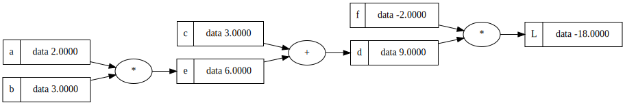

# Autograd from scratch
A minimal automatic differentiation engine built from scratch to understand neural network fundamentals. Inspired by Andrej Karpathy's [micrograd](https://github.com/karpathy/micrograd).


# Example Usage

Building an expression:

```python
from autograd import DataPoint 

a = DataPoint(data=2, _label='a')
b = DataPoint(data=3, _label='b')
c = DataPoint(data=3, _label='c')

e = a*b
e._label='e'

d = e + c
d._label='d'

f = DataPoint(data=-2, _label='f')
L = d * f
L._label='L'

```

Resulting expression: 




We want to calculate the derivate with respect to a term. We use the `DataPoint` data structure to build a three-like structure for computing gradients with respect to the last term. 


# Quick start

1. Install all dependencies by using a python virtual environment 
2. Download dependencies from `requirements.txt`
3. Start experimenting in a Jupyter notebook!